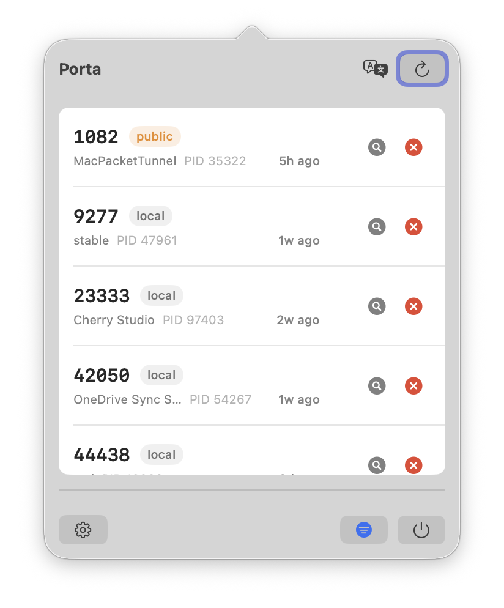
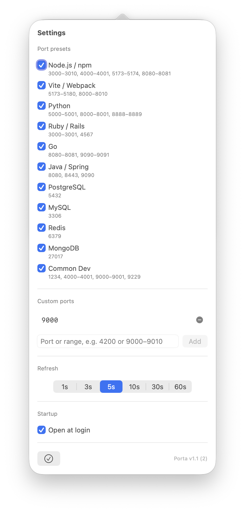

# Porta

**Project site:** https://jameswei.github.io/porta/

> A lightweight macOS menu-bar app that finds and kills orphan dev-server ports left by coding agents.

When AI coding agents launch development servers during sessions, those servers often keep running after the session ends. Porta sits in your menu bar, shows you all listening TCP ports matching your dev-tool presets, and lets you kill them with one click.

## Screenshots

<table>
  <tr>
    <td></td>
    <td></td>
  </tr>
  <tr>
    <td align="center"><em>Port list</em></td>
    <td align="center"><em>Settings</em></td>
  </tr>
</table>

## Features

- **Detect listening ports** — powered by `lsof`, shows TCP LISTEN-state ports from your configured dev tools
- **Kill with one click** — SIGTERM → 2 s wait → SIGKILL, with confirmation dialog and ownership re-check before signaling
- **Scope badge** — each port shows `local` (localhost-only) or `public` (all interfaces) so you know your exposure at a glance
- **Relative uptime** — see how long the process has been running ("5h ago", "2 min ago")
- **Configurable presets** — toggle by tool category: Node.js/npm, Vite/Webpack, Python, Ruby/Rails, Go, Java/Spring, PostgreSQL, MySQL, Redis, MongoDB, Common Dev
- **Custom ports** — add individual port numbers or ranges (e.g. `9000–9010`) with per-entry validation
- **Adjustable refresh** — 1 s, 3 s, 5 s, 10 s, 30 s, or 60 s polling interval
- **Launch at login** — stay ready in the background via `SMAppService`
- **Lightweight** — menu-bar only, no Dock icon, near-zero CPU/memory, no third-party dependencies

## Prerequisites

| Requirement | Notes |
|-------------|-------|
| macOS 13.0 (Ventura) or later | Required for `SMAppService` launch-at-login API |
| Xcode 15+ | To build from source |
| Any Apple ID (free) | For local code signing in Xcode |

## Build from Source

```bash
git clone https://github.com/jameswei/porta.git
cd porta
open Porta.xcodeproj
```

In Xcode:
1. Select the **Porta** scheme in the toolbar
2. Choose **My Mac** as the run destination
3. Press **⌘R** to build and run

> **First run tip:** If Xcode asks about signing, go to **Xcode → Settings → Accounts**, add your Apple ID, click **Manage Certificates**, and create an *Apple Development* certificate.

## Running a Downloaded Release

If you download a `.app` from GitHub Releases and macOS shows a Gatekeeper warning (because the build isn't signed with a paid Developer ID):

```bash
# Option A — strip the quarantine flag
xattr -cr /path/to/Porta.app
open /path/to/Porta.app

# Option B — right-click the .app → Open → "Open Anyway"
```

## Usage

1. Click the plug icon in the menu bar to open the port list
2. Each card shows: port number + scope badge, process name, PID, and relative start time
3. Click the magnifying glass to open Activity Monitor (process name is copied to clipboard — press **⌘F** and paste to find it)
4. Click **✕** to kill the owning process (confirmation required)
5. Click **⚙** (bottom-left) to open Settings: toggle presets, add custom ports, set refresh rate, enable launch at login
6. Click **⏻** or press **⌘Q** to quit

## Architecture

See [`docs/architecture.md`](./docs/architecture.md) for component structure, key design decisions, coding conventions, and testing guide.

## License

MIT — see [LICENSE](./LICENSE).
