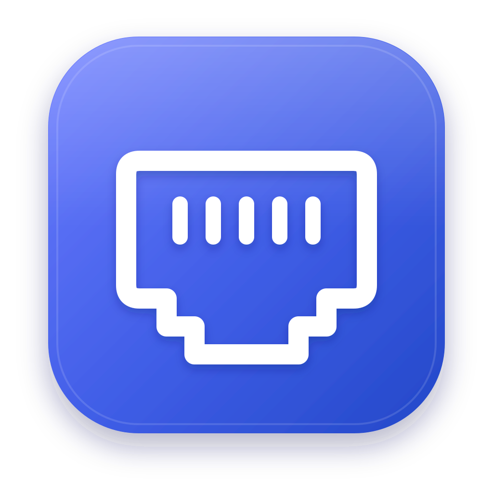
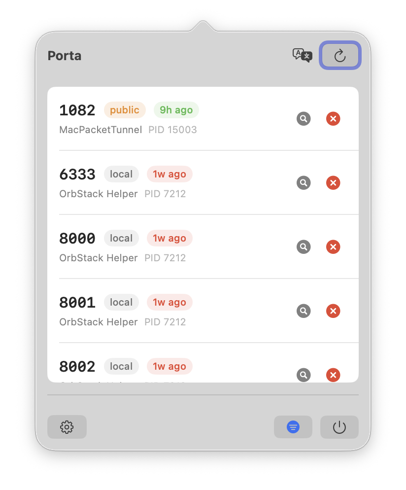
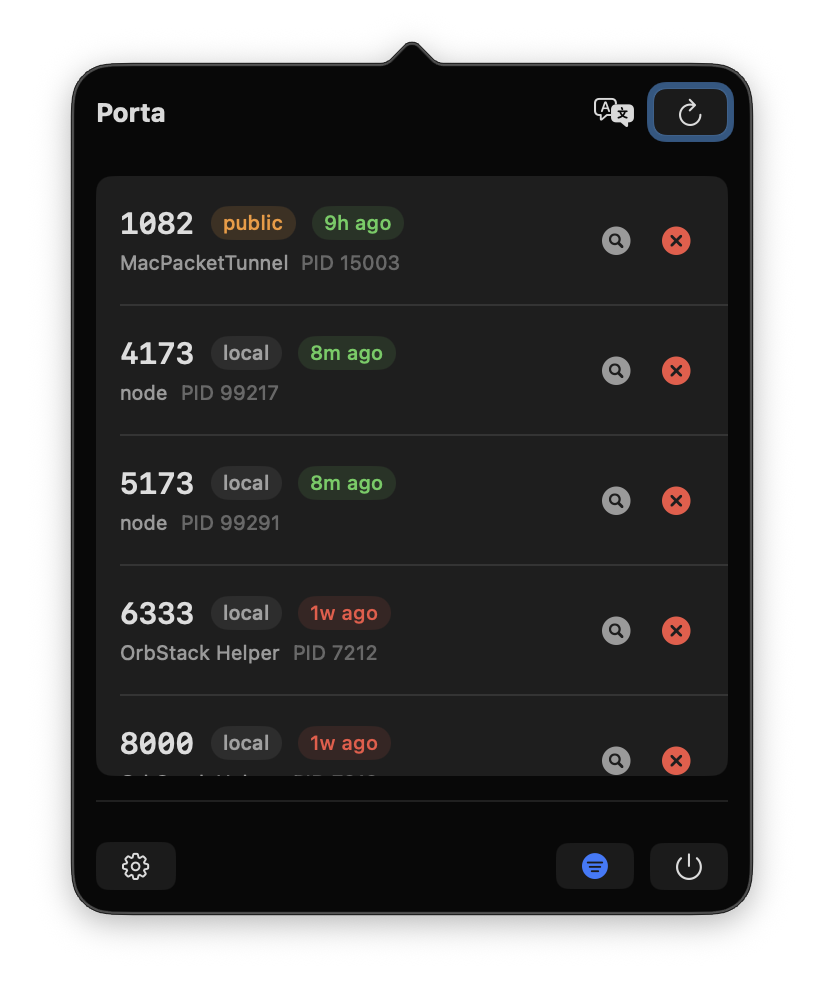
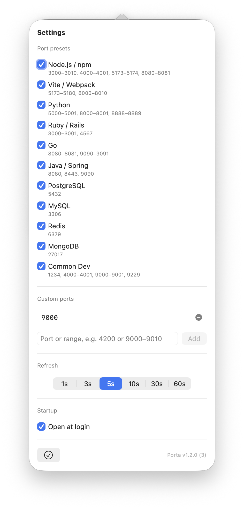

# Porta

[](https://github.com/jameswei/porta/actions/workflows/ci.yml)

**Project site:** https://jameswei.github.io/porta/ · [简体中文](./README.zh-CN.md)

<p align="center">
  
</p>

> A lightweight macOS menu-bar app for seeing and managing TCP listening ports.

Web servers, databases, background tools, and desktop apps can all keep TCP ports open. Porta shows matching LISTEN-state ports in your menu bar, identifies the owning process, exposure scope, and process age, and lets you inspect or stop the process with one click.

## Screenshots

<table>
  <tr>
    <td></td>
    <td></td>
    <td></td>
  </tr>
  <tr>
    <td align="center"><em>Port list · Light</em></td>
    <td align="center"><em>Port list · Dark</em></td>
    <td align="center"><em>Settings</em></td>
  </tr>
</table>

## Features

- **Detect listening ports** — powered by `lsof`, shows matching TCP LISTEN-state ports and their owning processes
- **Kill with one click** — SIGTERM → 2 s wait → SIGKILL, with confirmation dialog and ownership re-check before signaling
- **Scope badge** — each port shows `local` (localhost-only) or `public` (all interfaces) so you know your exposure at a glance
- **Color-coded process age** — a compact age pill helps triage listeners: green under 24 hours, amber from 1 day to under 3 days, and red from 3 days onward
- **Activity Monitor shortcut** — open Activity Monitor from any row with the process name already copied for quick lookup
- **Monitor All Ports** — toggle in the footer to bypass filters and see every TCP LISTEN port instantly; macOS system daemons (ControlCenter, mDNSResponder, etc.) are always hidden
- **Configurable presets** — toggle by tool category: Node.js/npm, Vite/Webpack, Python, Ruby/Rails, Go, Java/Spring, PostgreSQL, MySQL, Redis, MongoDB, Common Dev
- **Custom ports** — add individual port numbers or ranges (e.g. `9000–9010`) with per-entry validation
- **Adjustable refresh** — 1 s, 3 s, 5 s, 10 s, 30 s, or 60 s polling interval
- **Launch at login** — stay ready in the background via `SMAppService`
- **Automatic appearance** — follows macOS Light, Dark, and Auto appearance with no separate theme setting
- **English / Simplified Chinese** — switch language in-app (header translate button) independently of your OS locale; choice is remembered across sessions
- **Native and lightweight** — dedicated macOS app icon, menu-bar-only UI, no Dock icon, near-zero CPU/memory, and no third-party dependencies

## Prerequisites

| Requirement | Notes |
|-------------|-------|
| macOS 13.0 (Ventura) or later | Required for `SMAppService` launch-at-login API |
| Xcode 15+ | To build from source |
| Any Apple ID (free) | For local code signing in Xcode |

## Build from Source

```bash
git clone https://github.com/jameswei/porta.git
cd porta
open Porta.xcodeproj
```

In Xcode:
1. Select the **Porta** scheme in the toolbar
2. Choose **My Mac** as the run destination
3. Press **⌘R** to build and run

> **First run tip:** If Xcode asks about signing, go to **Xcode → Settings → Accounts**, add your Apple ID, click **Manage Certificates**, and create an *Apple Development* certificate.

## Running a Downloaded Release

If you download a `.app` from GitHub Releases and macOS shows a Gatekeeper warning (because the build isn't signed with a paid Developer ID):

```bash
# Option A — strip the quarantine flag
xattr -cr /path/to/Porta.app
open /path/to/Porta.app

# Option B — right-click the .app → Open → "Open Anyway"
```

## Usage

1. Click the plug icon in the menu bar to open the port list
2. Each row shows the port, exposure scope, color-coded process age, process name, and PID
3. Click the magnifying glass to open Activity Monitor (process name is copied to clipboard — press **⌘F** and paste to find it)
4. Click **✕** to kill the owning process (confirmation required)
5. Click the filter icon (bottom-center) to toggle **Monitor All Ports** — bypasses your preset/custom filters and shows every TCP listener
6. Click **⚙** (bottom-left) to open Settings: toggle presets, add custom ports, set refresh rate, enable launch at login; the app version is shown at the bottom of Settings
7. Click the **translate** icon (top-right) to switch between English and Simplified Chinese
8. Click **⏻** or press **⌘Q** to quit

## Architecture

See [`docs/architecture.md`](./docs/architecture.md) for component structure, key design decisions, coding conventions, and testing guide.

## Changelog

| Version | Date | Highlights |
|---------|------|------------|
| [v1.2.1](./CHANGELOG.md#121---2026-07-17) | 2026-07-17 | Fixed idle power drain — port polling now runs only while the popover is open |
| [v1.2.0](./CHANGELOG.md#120---2026-07-16) | 2026-07-16 | Dedicated app icon, color-coded process-age pills, automatic Light/Dark appearance |
| [v1.1.0](./CHANGELOG.md#110---2026-06-27) | 2026-06-27 | In-app Simplified Chinese, Monitor All Ports toggle, system daemon exclusion |
| [v1.0.0](./CHANGELOG.md#100---2026-06-26) | 2026-06-26 | Initial release — scope badge, relative uptime, presets, custom ports, 28 unit tests |

See [CHANGELOG.md](./CHANGELOG.md) for full details.

## License

MIT — see [LICENSE](./LICENSE).
